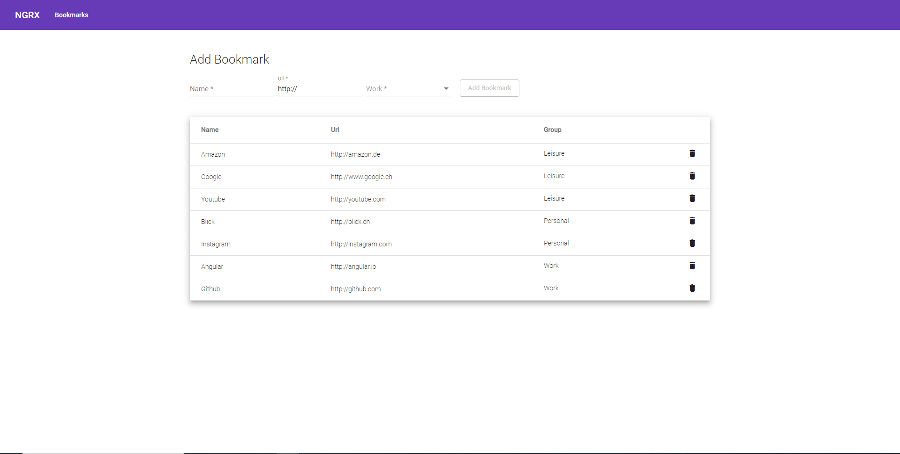

# Ngrx-Bookmarks-App

This project was generated with [Angular CLI](https://github.com/angular/angular-cli) version 8.3.26.

## Getting Started

Install dependencies with `npm install`.

## Development server

Run application `npm run start` to run the json-server on `http://localhost:3000/` and the client frontend on `http://localhost:4200/` concurrently.

## UI

The UI was developed using the Angular Material Libary.

## NGRX

NGRX for state management. Implemented load, create, delete actions. Reducer implemented with switch / case. Could be updated to new way of implementation with on()...

## Further information

Bookmarks are stored in the db.json file.
Prettier for Code Formatting.
